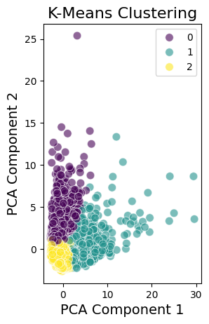
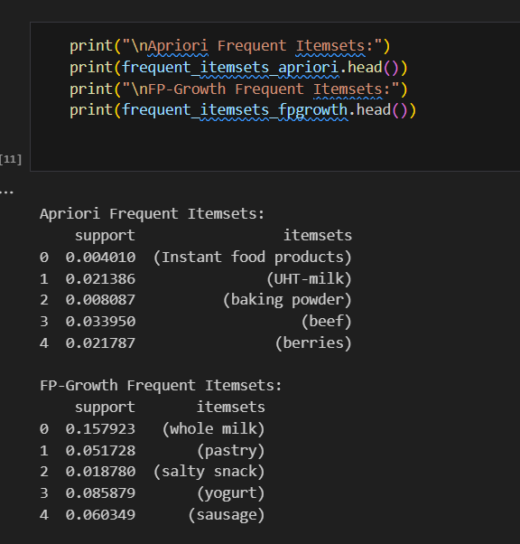
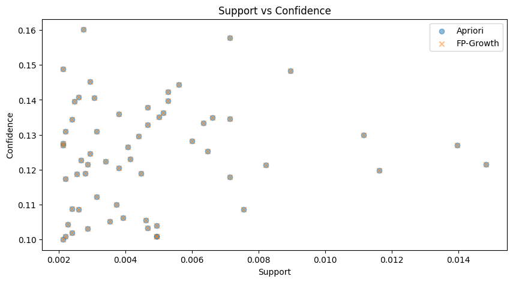
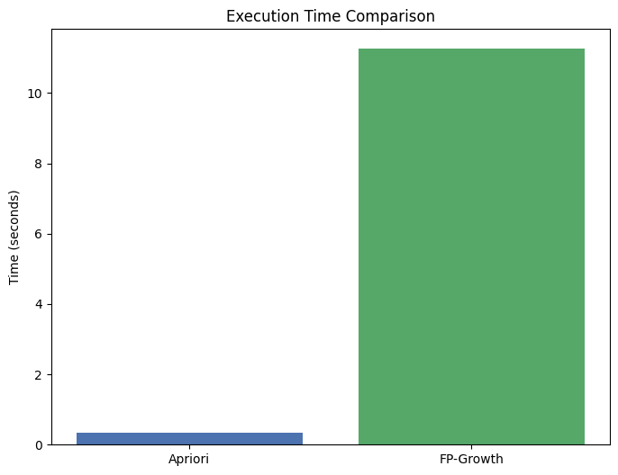

# 🏋️‍♂️ Health & Fitness Data Mining
A **comprehensive machine learning and data mining project** analyzing a health and fitness dataset using **classification**, **regression**, **clustering**, and **association rule mining** — with rich visualizations and evaluation metrics.

---

## 📊 Dataset Overview
The dataset contains features related to **health**, **nutrition**, and **physical activity**.

---

## 🌳 Decision Tree Classification
A **Decision Tree Classifier** was trained to classify health conditions.

- **Accuracy:** 90%  
- **Confusion Matrix:**
    
    
- **Classification Report:**
    

---

## 📈 Regression Analysis
Regression was used to predict a continuous health-related variable.

- **Feature Importance:**
    
- **Actual vs Predicted:**
    

---

## 🔗 K-Means Clustering
**K-Means** clustering was applied to group users based on their health profiles.

- **Elbow Method:**
    
- **Silhouette Scores:**
    
- **Final Clusters (PCA Visualization):**
    

---

## 🧾 Association Rules Mining
Applied **Apriori** and **FP-Growth** algorithms to discover relationships in transactional health data.

- **Rules Output:**
    
- **Support & Confidence Comparison:**
    
- **Execution Time Comparison:**
    

---

## 🛠 Tools & Technologies
- 🐍 Python (Pandas, Scikit-learn, Matplotlib, Seaborn)  
- 📓 Jupyter Notebook  

---

## ✅ Conclusion
This project demonstrates a **full ML pipeline**:  
- Data preparation  
- Model training  
- Evaluation  
- Visualization  

It highlights how data mining can generate actionable insights for **improving health & fitness decisions**.

---

## 👤 Author
**Mahmoud Elnahrawy**  
📧 mahmoudelnahrawywork@gmail.com  
📍 Cairo, Egypt  

---

## 🪪 License
MIT License — free to use, modify, and distribute.
