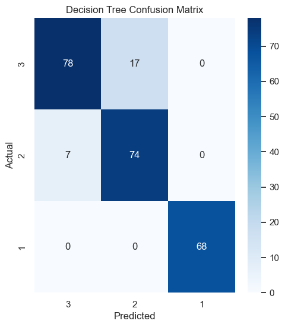
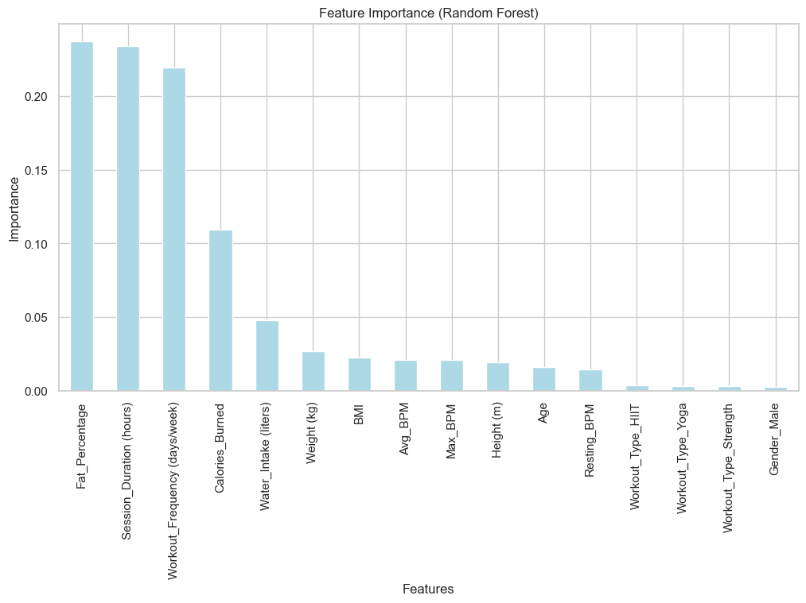
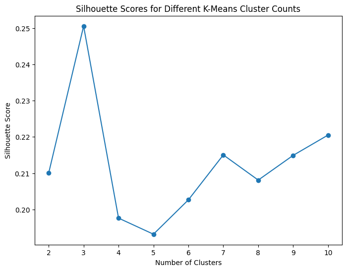
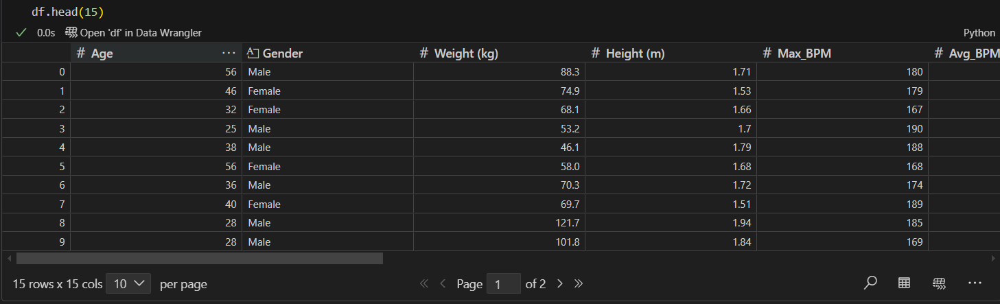

# 🧠 Health & Fitness Data Mining Project

This project applies various **machine learning and data mining techniques** to a health and fitness dataset to uncover patterns, make predictions, and cluster users based on fitness and lifestyle factors.

---

## 📊 Dataset Preview

The dataset includes attributes like:
- Demographics: Age, Gender
- Physical Stats: Weight, Height, BMI
- Workout Habits: Frequency, Duration, Type
- Health Metrics: BPM (Avg & Max), Calories Burned, Water Intake

---

## 🔍 Classification – Decision Tree

Using a Decision Tree Classifier to categorize individuals based on their health/fitness level.

**Accuracy:** 90%  
**Best Class Performance:** Class 3 (F1 = 1.00)

📌 Metrics:
  
📊 Visual:

---

## 📈 Feature Importance (Random Forest)

Top contributing features in classification:
- Fat Percentage
- Session Duration
- Workout Frequency
- Calories Burned

---

## 📉 Regression – Predicting a Continuous Outcome

### Linear Regression
- R² Score: 0.82
- MAE: 2.86
- RMSE: 3.90

### Decision Tree Regressor
- R² Score: 0.93
- MAE: 1.52
- RMSE: 2.50

📋 Metrics:
  
📈 Linear Regression Result:

---

## 📊 Clustering (K-Means)

### 1. Elbow Method  

### 2. Silhouette Score  

### 3. Final Clusters Visualized with PCA  

---

## 🧰 Tech Stack

- Python
- Scikit-learn
- Pandas / NumPy / Matplotlib / Seaborn
- Jupyter Notebook

---

## 📬 Contact

[GitHub – NA7RAWY](https://github.com/NA7RAWY)
